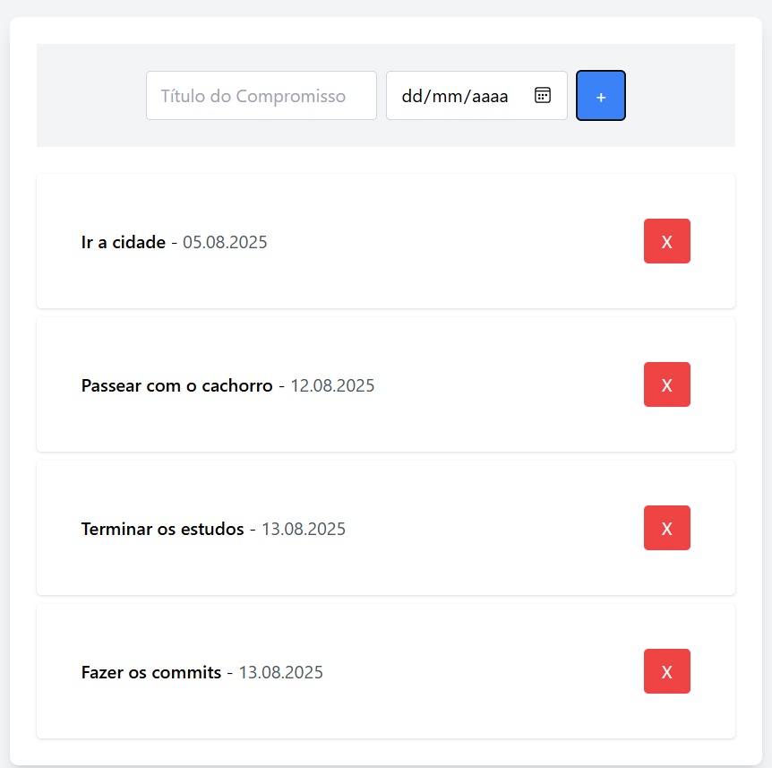

# 📅 Appointment App

Um aplicativo simples de gerenciamento de compromissos desenvolvido para estudo e prática dos conceitos fundamentais do **Angular**.Appointment App

Um aplicativo simples de gerenciamento de compromissos desenvolvido para estudo e prática dos conceitos fundamentais do **Angular**.

##  Objetivo do Projeto

Este projeto foi criado como parte de um curso de 6 dias de Angular, com o objetivo de:
- Aprender os conceitos básicos do framework Angular
- Praticar a criação de componentes
- Implementar comunicação entre componentes
- Trabalhar com serviços e gerenciamento de estado
- Utilizar localStorage para persistência de dados
- Aplicar boas práticas de desenvolvimento

##  Tecnologias Utilizadas

- **Angular 19.2.11** - Framework principal
- **TypeScript** - Linguagem de programação
- **Tailwind CSS** - Framework CSS para estilização
- **RxJS** - Programação reativa
- **LocalStorage** - Persistência de dados no navegador
  

##  Arquitetura

O projeto segue uma arquitetura simples e organizada:

`
src/
 app/
    components/
       appointment-board/     # Componente para adicionar compromissos
       appointment-list/      # Componente para listar compromissos
    models/
       appointment.ts         # Interface do modelo de dados
    services/
       appointment.service.ts # Serviço para gerenciamento de dados
    app.component.*            # Componente raiz
`

### Componentes

- **AppointmentBoardComponent**: Responsável por capturar novos compromissos através de um formulário
- **AppointmentListComponent**: Exibe a lista de compromissos salvos com opção de exclusão

### Serviço

- **AppointmentService**: Gerencia o estado da aplicação, persistência no localStorage e comunicação entre componentes usando RxJS

##  Instalação e Uso

### Pré-requisitos

- Node.js (versão 18 ou superior)
- npm ou yarn
- Angular CLI (
pm install -g @angular/cli)

### Instalação

1. Clone o repositório:
`ash
git clone https://github.com/AntonioRian/appointment-app.git
cd appointment-app
`

2. Instale as dependências:
`ash
npm install
`

3. Inicie o servidor de desenvolvimento:
`ash
ng serve
`

4. Abra o navegador e acesse: http://localhost:4200

##  Persistência de Dados

Os dados são automaticamente salvos no **localStorage** do navegador, garantindo que:
- Os compromissos persistam entre sessões
- As alterações são refletidas em tempo real
- Não há necessidade de banco de dados externo

##  Funcionalidades

-  Adicionar novos compromissos
-  Listar compromissos existentes
-  Excluir compromissos
-  Interface responsiva com Tailwind CSS
-  Persistência automática de dados
-  Atualização em tempo real da lista

## 📚 Contribuições

Este é um projeto de estudo, mas sugestões e melhorias são bem-vindas!

##  Licença

Este projeto é apenas para fins educacionais.

---

**Desenvolvido durante o curso Angular 6 Days**
